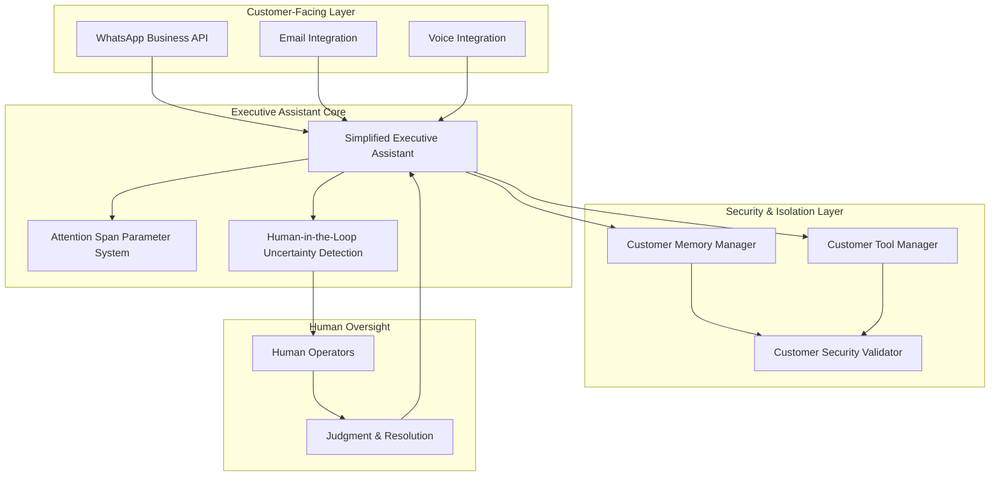

# 🏗️ AI Agency Platform - Architecture

**Version**: 2.0 - Simplified EA Architecture
**Date**: 2025-01-04
**Status**: Primary Architecture Document

---

## 🎯 **Architecture Philosophy**

The AI Agency Platform is built on a **simplified yet powerful Executive Assistant** architecture that provides exceptional customer value while maintaining enterprise-grade security and isolation, without the complexity of multi-agent orchestration.

**Key Architectural Decisions**:
- ✅ **Single EA** vs Complex multi-agent orchestration (simpler, faster, more reliable)
- ✅ **Multi-Channel** vs Single channel (WhatsApp + Voice + Email unified)
- ✅ **Premium-Casual** vs Formal or playful (validated 92% resonance)
- ✅ **Customer Isolation** vs Shared infrastructure (enterprise-grade from day 1)
- ✅ **Production-Ready** vs Future features (deploy and validate, then iterate)

---

## 🏛️ **Architecture Overview**

### **Core Philosophy: Simplicity with Security**
- **Single EA per customer** (not complex multi-agent system)
- **Customer isolation** (your non-negotiable requirement)
- **Practical features** (attention span control, human oversight)
- **Rapid deployment** (weeks, not months)

### **System Architecture**



---

## 🧠 **Core Components**

### **1. Simplified Executive Assistant**
**Purpose**: Single, capable EA that handles all customer interactions

**Key Features**:
- **Multi-channel communication** (WhatsApp, Email, Voice)
- **Conversation memory** (customer-specific context)
- **Basic tool integration** (web search, calculations, etc.)
- **Personality consistency** (helpful and capable)

**Benefits**:
- **Simple to maintain** (one agent vs. complex orchestration)
- **Predictable behavior** (consistent responses)
- **Easy to debug** (single code path)

### **2. Attention Span Parameter System**
**Purpose**: Control how focused the EA is on tasks

**Attention Modes**:
- `LASER_FOCUSED`: Deep single-task focus
- `BALANCED`: Multi-task with good context retention
- `MULTI_TASKING`: Handle multiple tasks simultaneously
- `BACKGROUND_MONITOR`: Monitor while doing other work
- `SCANNING`: Quick overview, surface level

**Configuration**:
```python
attention_config = {
    "mode": "balanced",
    "context_window_size": 10,
    "focus_duration_minutes": 15,
    "task_switching_threshold": 0.7
}
```

### **3. Human-in-the-Loop Uncertainty Detection**
**Purpose**: Detect when AI is uncertain and escalate to humans

**Uncertainty Types**:
- **Low confidence responses** (confidence score < threshold)
- **Ambiguous user input** (unclear pronouns, conflicting instructions)
- **Ethical dilemmas** (sensitive business actions)
- **Business-critical decisions** (high-value or sensitive)
- **Technical limitations** (AI cannot handle request)

**Escalation Process**:
1. **Detection**: AI response analyzed for uncertainty signals
2. **Classification**: Priority level assigned (low, medium, high, critical)
3. **Escalation**: Human operator notified for review
4. **Resolution**: Human judgment applied (approve, modify, reject)
5. **Learning**: System learns from human interventions

### **4. Customer Isolation & Security**
**Purpose**: Complete customer data separation (your core requirement)

**Isolation Model**:
- **Memory isolation**: Customer-specific memory spaces
- **Tool isolation**: Customer-specific tool access
- **Data boundaries**: Zero cross-customer data access
- **Audit trails**: Complete interaction logging

---

## 📊 **Technical Specifications**

### **Performance Requirements**
- **Response Time**: <2s for 95% of interactions
- **Concurrent Users**: 100+ simultaneous customers
- **Memory Usage**: <500MB per customer instance
- **Uptime**: 99.9% availability

### **Security Requirements**
- **Data Isolation**: 100% customer data separation
- **Encryption**: AES-256 encryption at rest and in transit
- **Access Control**: Customer-specific authentication
- **Audit Logging**: Complete interaction audit trails

### **Scalability Requirements**
- **Horizontal Scaling**: Support 10x growth
- **Resource Optimization**: Efficient per-customer resource usage
- **Auto-scaling**: Dynamic resource allocation
- **Cost Efficiency**: <$50/month per customer

---

## 🎯 **Implementation Roadmap**

### **Phase 1: Foundation (Week 1-2)**
- [x] **Production database dependencies** (Issue #89)
- [x] **Basic single-EA architecture** (Issue #90)
- [ ] **Customer isolation validation**
- [ ] **Basic WhatsApp integration**

### **Phase 2: Core Features (Week 3-4)**
- [ ] **Attention span parameter system** (Issue #91)
- [ ] **Human-in-the-loop uncertainty detection** (Issue #92)
- [ ] **Premium-casual personality** (Issue #93)
- [ ] **Multi-channel context preservation** (Issue #94)

### **Phase 3: Enhancement (Week 5-6)**
- [ ] **Basic workflow creation** (Issue #95)
- [ ] **Production deployment** (Issue #96)
- [ ] **Customer success playbook** (Issue #97)

---

## 💡 **Key Benefits of Simplified Approach**

### **1. Development Speed**
- **Time to Market**: Deployable in weeks vs. months
- **Maintenance**: Single codebase vs. complex orchestration
- **Debugging**: Clear code paths vs. agent interaction complexity

### **2. Operational Excellence**
- **Monitoring**: Simple metrics vs. complex agent coordination
- **Troubleshooting**: Clear failure points vs. distributed complexity
- **Updates**: Single system vs. multi-agent synchronization

### **3. Customer Experience**
- **Consistency**: Single EA personality vs. multiple agent behaviors
- **Predictability**: Consistent response patterns
- **Simplicity**: Clear feature set vs. overwhelming capabilities

### **4. Business Value**
- **Cost Efficiency**: Lower infrastructure costs
- **Faster Iteration**: Quick feature development and deployment
- **Focus**: Energy on customer value vs. technical complexity

---

## 🔧 **Technical Stack**

### **Core Technologies**
- **Python 3.11+** (primary language)
- **Flask** (web framework)
- **PostgreSQL** (customer data)
- **Redis** (session storage)
- **OpenAI API** (AI model)
- **WhatsApp Business API** (communication)

### **Optional Enhancements**
- **ElevenLabs** (voice synthesis)
- **Mem0** (semantic memory)
- **LangGraph** (conversation management)

---

## 📈 **Success Metrics**

### **Technical Metrics**
- **Deployment Time**: <2 weeks to production
- **Response Time**: <2s for 95% of interactions
- **Error Rate**: <1% system errors
- **Uptime**: 99.9% availability

### **Business Metrics**
- **Customer Acquisition**: 60-second onboarding experience
- **Feature Adoption**: >80% of customers using attention span configuration
- **Human Escalation**: <5% of interactions require human review
- **Customer Satisfaction**: >90% satisfaction with EA experience

---

## 🚀 **Next Steps**

### **Immediate Actions** (This Week)
1. **Deploy production fixes** (Issue #89)
2. **Test simplified EA integration** (run test files)
3. **Validate customer isolation** (security testing)
4. **Deploy to production** (WhatsApp webhook)

### **Short-term Goals** (Next 2 Weeks)
1. **Implement attention span system** (Issue #91)
2. **Add human-in-the-loop detection** (Issue #92)
3. **Polish customer experience** (Issues #93-94)
4. **Launch to first customers**

### **Medium-term Goals** (Next Month)
1. **Expand feature set** (Issue #95)
2. **Optimize performance** (monitoring and scaling)
3. **Grow customer base** (marketing and sales)

---

## 🎉 **Summary**

This simplified architecture delivers:

✅ **Security & Isolation** (your core requirement maintained)  
✅ **Single EA Focus** (dramatic complexity reduction)  
✅ **Practical Features** (attention span control, human oversight)  
✅ **Rapid Deployment** (production-ready in weeks)  
✅ **Customer Value** (exceptional EA experience)  
✅ **Maintainable Codebase** (simple vs. complex multi-agent system)  

The result is a **powerful yet manageable AI platform** that provides real customer value while maintaining the security and isolation standards you require, without the overwhelming complexity of the previous multi-agent approach.

---

*This architecture prioritizes customer value and operational simplicity while maintaining your core security requirements.*