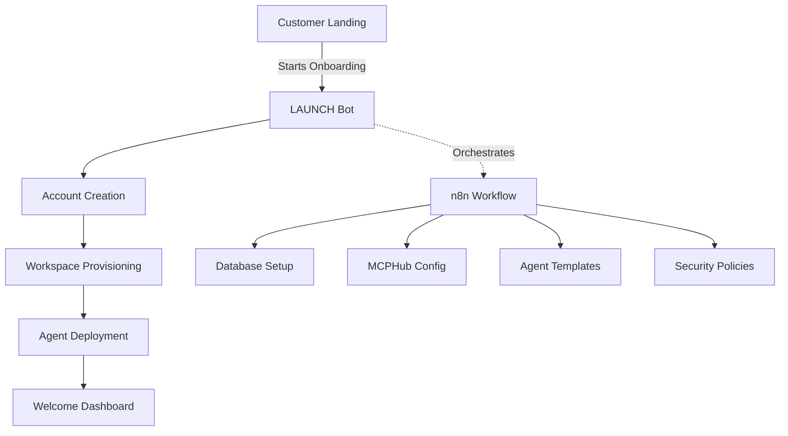

# LAUNCH Bot Architecture
## <60 Second Customer Onboarding System

### Overview
LAUNCH Bot is the automated customer onboarding system that provisions a complete AI agency workspace in under 60 seconds.

### Architecture Components



### Technical Implementation

#### 1. Entry Point (0-5 seconds)
```yaml
Trigger: Webhook from landing page
Input:
  - email: Customer email
  - company: Company name
  - use_case: Selected use case (sales/support/operations)
Actions:
  - Validate email domain
  - Check for existing account
  - Generate workspace ID
```

#### 2. Account Creation (5-15 seconds)
```yaml
Database Operations:
  - Create customer record
  - Generate JWT tokens
  - Set up tenant isolation
  - Initialize billing record
Security:
  - bcrypt password hashing
  - JWT token generation
  - Row-level security policies
```

#### 3. Workspace Provisioning (15-30 seconds)
```yaml
Infrastructure:
  - Create isolated database schema
  - Configure MCPHub routing
  - Set up n8n workflow space
  - Initialize vector store partition
Resources:
  - Allocate compute resources
  - Set rate limits
  - Configure monitoring
```

#### 4. Agent Deployment (30-45 seconds)
```yaml
Core Agents:
  - Customer Success Agent
  - Data Processing Agent
  - Workflow Automation Agent
Configuration:
  - Load agent templates
  - Set permissions
  - Configure tool access
```

#### 5. Welcome Experience (45-60 seconds)
```yaml
Dashboard Setup:
  - Personalized welcome message
  - Quick start guides
  - Sample workflows
  - Integration tutorials
```

### Database Schema

```sql
-- Customer onboarding tables
CREATE TABLE customers (
    id UUID PRIMARY KEY DEFAULT gen_random_uuid(),
    email VARCHAR(255) UNIQUE NOT NULL,
    company_name VARCHAR(255) NOT NULL,
    workspace_id UUID UNIQUE NOT NULL,
    use_case VARCHAR(50),
    onboarded_at TIMESTAMP DEFAULT NOW(),
    onboarding_duration_ms INTEGER,
    status VARCHAR(50) DEFAULT 'active'
);

CREATE TABLE workspaces (
    id UUID PRIMARY KEY,
    customer_id UUID REFERENCES customers(id),
    schema_name VARCHAR(100) UNIQUE NOT NULL,
    mcphub_config JSONB,
    agent_config JSONB,
    resource_limits JSONB,
    created_at TIMESTAMP DEFAULT NOW()
);

CREATE TABLE onboarding_events (
    id UUID PRIMARY KEY DEFAULT gen_random_uuid(),
    customer_id UUID REFERENCES customers(id),
    event_type VARCHAR(50),
    event_data JSONB,
    timestamp TIMESTAMP DEFAULT NOW(),
    duration_ms INTEGER
);

-- Row Level Security
ALTER TABLE customers ENABLE ROW LEVEL SECURITY;
ALTER TABLE workspaces ENABLE ROW LEVEL SECURITY;

CREATE POLICY customer_isolation ON customers
    FOR ALL USING (id = current_setting('app.customer_id')::UUID);

CREATE POLICY workspace_isolation ON workspaces
    FOR ALL USING (customer_id = current_setting('app.customer_id')::UUID);
```

### n8n Workflow Implementation

```json
{
  "name": "LAUNCH Bot Onboarding",
  "nodes": [
    {
      "id": "webhook_trigger",
      "type": "n8n-nodes-base.webhook",
      "typeVersion": 1,
      "position": [250, 300],
      "parameters": {
        "path": "/launch-onboarding",
        "httpMethod": "POST",
        "responseMode": "responseNode"
      }
    },
    {
      "id": "validate_input",
      "type": "n8n-nodes-base.code",
      "typeVersion": 2,
      "position": [450, 300],
      "parameters": {
        "language": "javascript",
        "code": "// Validate and prepare onboarding data\nconst { email, company, use_case } = $input.item.json;\n\nif (!email || !company) {\n  throw new Error('Email and company are required');\n}\n\nconst workspaceId = crypto.randomUUID();\nconst schemaName = `customer_${company.toLowerCase().replace(/[^a-z0-9]/g, '_')}`;\n\nreturn {\n  email,\n  company,\n  use_case: use_case || 'general',\n  workspaceId,\n  schemaName,\n  startTime: Date.now()\n};"
      }
    },
    {
      "id": "create_customer",
      "type": "n8n-nodes-base.postgres",
      "typeVersion": 2.4,
      "position": [650, 300],
      "parameters": {
        "operation": "executeQuery",
        "query": "INSERT INTO customers (email, company_name, workspace_id, use_case)\nVALUES ($1, $2, $3, $4)\nRETURNING *",
        "additionalFields": {
          "queryParams": "={{$json.email}},={{$json.company}},={{$json.workspaceId}},={{$json.use_case}}"
        }
      }
    },
    {
      "id": "provision_workspace",
      "type": "n8n-nodes-base.httpRequest",
      "typeVersion": 4.2,
      "position": [850, 300],
      "parameters": {
        "method": "POST",
        "url": "http://localhost:3000/api/workspace/provision",
        "sendBody": true,
        "bodyParameters": {
          "parameters": [
            {
              "name": "customerId",
              "value": "={{$json.id}}"
            },
            {
              "name": "workspaceId",
              "value": "={{$json.workspace_id}}"
            },
            {
              "name": "schemaName",
              "value": "={{$json.schemaName}}"
            }
          ]
        }
      }
    },
    {
      "id": "deploy_agents",
      "type": "n8n-nodes-base.httpRequest",
      "typeVersion": 4.2,
      "position": [1050, 300],
      "parameters": {
        "method": "POST",
        "url": "http://localhost:3000/api/agents/deploy",
        "sendBody": true,
        "bodyParameters": {
          "parameters": [
            {
              "name": "workspaceId",
              "value": "={{$json.workspaceId}}"
            },
            {
              "name": "useCase",
              "value": "={{$json.use_case}}"
            },
            {
              "name": "agents",
              "value": "[\"customer-success\", \"data-processor\", \"workflow-automation\"]"
            }
          ]
        }
      }
    },
    {
      "id": "generate_credentials",
      "type": "n8n-nodes-base.code",
      "typeVersion": 2,
      "position": [1250, 300],
      "parameters": {
        "language": "javascript",
        "code": "// Generate JWT and API credentials\nconst jwt = require('jsonwebtoken');\nconst bcrypt = require('bcrypt');\n\nconst temporaryPassword = crypto.randomBytes(16).toString('hex');\nconst hashedPassword = await bcrypt.hash(temporaryPassword, 10);\n\nconst token = jwt.sign(\n  { \n    customerId: $json.customerId,\n    workspaceId: $json.workspaceId,\n    email: $json.email \n  },\n  process.env.JWT_SECRET,\n  { expiresIn: '7d' }\n);\n\nreturn {\n  ...$json,\n  credentials: {\n    temporaryPassword,\n    hashedPassword,\n    jwtToken: token,\n    apiKey: crypto.randomBytes(32).toString('hex')\n  },\n  onboardingDuration: Date.now() - $json.startTime\n};"
      }
    },
    {
      "id": "send_welcome_email",
      "type": "n8n-nodes-base.emailSend",
      "typeVersion": 2.1,
      "position": [1450, 300],
      "parameters": {
        "fromEmail": "welcome@aiagency.platform",
        "toEmail": "={{$json.email}}",
        "subject": "Welcome to AI Agency Platform - Your Workspace is Ready!",
        "emailType": "html",
        "message": "<h1>Welcome {{$json.company}}!</h1>\n<p>Your AI agency workspace has been created in {{$json.onboardingDuration}}ms</p>\n<h2>Quick Start:</h2>\n<ul>\n<li>Dashboard: https://platform.aiagency.com/workspace/{{$json.workspaceId}}</li>\n<li>Temporary Password: {{$json.credentials.temporaryPassword}}</li>\n<li>API Key: {{$json.credentials.apiKey}}</li>\n</ul>\n<p>Your agents are ready to work!</p>"
      }
    },
    {
      "id": "webhook_response",
      "type": "n8n-nodes-base.respondToWebhook",
      "typeVersion": 1,
      "position": [1650, 300],
      "parameters": {
        "respondWith": "json",
        "responseBody": "{\n  \"success\": true,\n  \"workspaceId\": \"{{$json.workspaceId}}\",\n  \"dashboardUrl\": \"https://platform.aiagency.com/workspace/{{$json.workspaceId}}\",\n  \"onboardingTime\": \"{{$json.onboardingDuration}}ms\",\n  \"message\": \"Your AI agency is ready! Check your email for credentials.\"\n}"
      }
    }
  ],
  "connections": {
    "webhook_trigger": {
      "main": [["validate_input"]]
    },
    "validate_input": {
      "main": [["create_customer"]]
    },
    "create_customer": {
      "main": [["provision_workspace"]]
    },
    "provision_workspace": {
      "main": [["deploy_agents"]]
    },
    "deploy_agents": {
      "main": [["generate_credentials"]]
    },
    "generate_credentials": {
      "main": [["send_welcome_email"]]
    },
    "send_welcome_email": {
      "main": [["webhook_response"]]
    }
  }
}
```

### Performance Metrics

```yaml
Target Metrics:
  - Total onboarding time: <60 seconds
  - Account creation: <5 seconds
  - Workspace provisioning: <15 seconds
  - Agent deployment: <20 seconds
  - Success rate: >95%

Monitoring:
  - Real-time onboarding dashboard
  - Event tracking for each step
  - Performance bottleneck alerts
  - Customer journey analytics
```

### Agent Templates

```yaml
Customer Success Agent:
  tools:
    - Email communication
    - Ticket management
    - Knowledge base search
    - Sentiment analysis
  initial_prompts:
    - "Help customers get started"
    - "Answer product questions"
    - "Collect feedback"

Data Processing Agent:
  tools:
    - Data transformation
    - CSV/JSON processing
    - Database queries
    - Report generation
  initial_prompts:
    - "Process customer data"
    - "Generate insights"
    - "Create reports"

Workflow Automation Agent:
  tools:
    - n8n workflow creation
    - API integration
    - Schedule management
    - Event triggers
  initial_prompts:
    - "Automate repetitive tasks"
    - "Connect systems"
    - "Monitor workflows"
```

### Error Handling

```yaml
Failure Scenarios:
  - Database connection failure: Retry with exponential backoff
  - MCPHub unavailable: Queue for later provisioning
  - Agent deployment failure: Rollback and alert
  - Email delivery failure: Store credentials securely for retrieval

Recovery Process:
  - Automatic retry for transient failures
  - Manual intervention queue for persistent issues
  - Customer notification of delays
  - Compensation for extended onboarding times
```

### Security Considerations

```yaml
Authentication:
  - Temporary passwords expire in 24 hours
  - JWT tokens with 7-day expiration
  - API keys with rate limiting
  - MFA setup prompted on first login

Isolation:
  - Database schema per customer
  - Row-level security policies
  - Resource quotas enforced
  - Network segmentation

Compliance:
  - Audit log of all onboarding events
  - GDPR-compliant data handling
  - Encryption at rest and in transit
  - Regular security scans
```