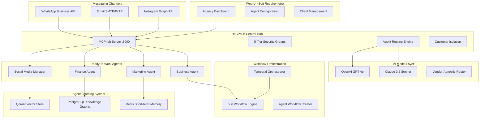

# AI Agency Platform - Technical Design Document (TDD)

**Document Type:** Technical Design Document  
**Version:** 5.0 - Compact & PRD-Mapped  
**Date:** August 22, 2025

## Executive Summary

### Vision Statement
Vendor-agnostic AI Agency Platform enabling businesses to deploy ready-to-work messaging agents (WhatsApp/Email/Instagram) that learn, adapt, and create their own workflows through n8n and Temporal orchestration.

### Technical Innovation
- **Ready-to-Work Agents:** 4 messaging-connected agents (Social Media Manager, Finance, Marketing, Business)
- **Agent Learning System:** Qdrant vector store + PostgreSQL knowledge graphs + Redis memory
- **Workflow Automation:** Agents create and manage n8n workflows autonomously
- **24/7 Operation:** Temporal orchestration for reliable execution
- **Vendor-Agnostic AI:** OpenAI, Claude, Meta, DeepSeek, local model support

---

## System Architecture

### Phase 1 Architecture (Current Priority)



### Database Architecture

```yaml
PostgreSQL_Primary:
  customers:
    - customer_id, email, company, workspace_id
    - Row-level security for complete isolation
  
  agent_knowledge_graphs:
    - agent_id, entity_type, relationships, metadata
    - Customer-isolated knowledge storage
    
  conversation_history:
    - session_id, customer_id, agent_id, messages
    - Learning data for agent improvement
    
  workflows:
    - workflow_id, agent_id, n8n_data, status
    - Agent-created workflow storage

Qdrant_Vector_Store:
  agent_memory_collections:
    - Customer-isolated vector collections
    - Semantic search for agent responses
    - Learning pattern storage
    
Redis_Cache:
  sessions: Short-term conversation context
  queues: Temporal workflow tasks
  real_time: Agent coordination data
```

## Core Components

### 1. Ready-to-Work Agent System

```typescript
// Base Agent Architecture
interface ReadyToWorkAgent {
  id: string;
  type: 'social_media' | 'finance' | 'marketing' | 'business';
  messagingChannels: ['whatsapp', 'email', 'instagram'];
  learningSystem: AgentMemory;
  workflowCreator: N8nIntegration;
  temporalOrchestrator: TemporalClient;
}

class AgentMemory {
  vectorStore: QdrantClient;
  knowledgeGraph: PostgreSQLGraph;
  shortTermMemory: RedisClient;
  
  async learn(interaction: CustomerInteraction): Promise<void> {
    // Store interaction in vector store for semantic retrieval
    await this.vectorStore.upsert({
      id: interaction.id,
      vector: await this.embedInteraction(interaction),
      payload: interaction
    });
    
    // Update knowledge graph relationships
    await this.knowledgeGraph.updateRelationships(interaction);
    
    // Cache for immediate access
    await this.shortTermMemory.setex(
      `session:${interaction.sessionId}`, 
      3600, 
      JSON.stringify(interaction)
    );
  }
  
  async recall(query: string): Promise<CustomerInteraction[]> {
    const queryVector = await this.embedQuery(query);
    return await this.vectorStore.search(queryVector, { limit: 10 });
  }
}
```

### 2. Messaging Integration Layer

```typescript
// Multi-Channel Messaging System
class MessagingHub {
  whatsappAPI: WhatsAppBusinessAPI;
  emailService: EmailSMTPService;
  instagramAPI: InstagramGraphAPI;
  
  async routeMessage(message: IncomingMessage, agent: ReadyToWorkAgent): Promise<void> {
    // Route message to appropriate agent based on content and customer
    const response = await agent.processMessage(message);
    
    // Send response through appropriate channel
    switch (message.channel) {
      case 'whatsapp':
        await this.whatsappAPI.sendMessage(message.from, response);
        break;
      case 'email':
        await this.emailService.sendEmail(message.from, response);
        break;
      case 'instagram':
        await this.instagramAPI.sendDM(message.from, response);
        break;
    }
    
    // Log interaction for learning
    await agent.learningSystem.learn({
      input: message.content,
      output: response,
      channel: message.channel,
      timestamp: Date.now()
    });
  }
}
```

### 3. Workflow Automation System

```typescript
// Agent Workflow Creation
class AgentWorkflowCreator {
  n8nClient: N8nAPIClient;
  temporalClient: TemporalClient;
  
  async createWorkflow(agent: ReadyToWorkAgent, task: AutomationTask): Promise<string> {
    // Analyze task to determine optimal workflow
    const workflowTemplate = await this.analyzeTaskRequirements(task);
    
    // Generate n8n workflow JSON
    const n8nWorkflow = {
      name: `${agent.type}_${task.type}_${Date.now()}`,
      nodes: await this.generateNodes(workflowTemplate),
      connections: await this.generateConnections(workflowTemplate)
    };
    
    // Deploy to n8n
    const workflowId = await this.n8nClient.createWorkflow(n8nWorkflow);
    
    // Schedule with Temporal for 24/7 execution
    await this.temporalClient.startWorkflow({
      workflowId: `agent_${agent.id}_workflow_${workflowId}`,
      taskQueue: 'agent-workflows',
      workflowType: 'AgentWorkflowExecutor'
    });
    
    return workflowId;
  }
}
```

### 4. Temporal Orchestration

```typescript
// 24/7 Agent Operation with Temporal
@Workflow()
export class AgentWorkflowExecutor {
  @WorkflowMain()
  async execute(params: AgentWorkflowParams): Promise<void> {
    // Continuous agent operation loop
    while (true) {
      // Check for pending messages
      const messages = await Activities.checkPendingMessages(params.agentId);
      
      // Process each message
      for (const message of messages) {
        await Activities.processMessage(params.agentId, message);
      }
      
      // Check for workflow creation opportunities
      const automationOpportunities = await Activities.identifyAutomationOpportunities(params.agentId);
      
      for (const opportunity of automationOpportunities) {
        await Activities.createWorkflow(params.agentId, opportunity);
      }
      
      // Sleep for optimal polling interval
      await sleep('30s');
    }
  }
}

// Temporal Activities for reliable execution
export const Activities = {
  async processMessage(agentId: string, message: Message): Promise<void> {
    // Implement with retry logic and error handling
  },
  
  async createWorkflow(agentId: string, opportunity: AutomationOpportunity): Promise<void> {
    // Implement workflow creation with rollback on failure
  }
};
```

### 5. MCPhub Security & Routing

```yaml
MCPhub_Configuration:
  security_groups:
    tier_0_personal: Owner-only access
    tier_1_development: Team infrastructure
    tier_2_business: Business operations
    tier_3_customer: Customer-isolated access
    tier_4_public: Public demo access
    
  agent_routing:
    social_media_management: Routes to social media agent based on keywords
    financial_queries: Routes to finance agent for money-related topics
    marketing_campaigns: Routes to marketing agent for campaigns
    business_operations: Routes to business agent for general tasks
    
  customer_isolation:
    database_separation: Row-level security per customer
    vector_collections: Customer-specific Qdrant collections
    workflow_isolation: Customer-specific n8n workspaces
```

## Performance & Scalability

### Phase 1 Requirements
```yaml
Performance_Targets:
  agent_response_time: <2 seconds average
  messaging_delivery: <5 seconds across all channels
  learning_update: <1 second for memory storage
  workflow_creation: <30 seconds for simple workflows
  concurrent_customers: 100+ simultaneous users
  
Scalability_Design:
  horizontal_scaling: Docker containers with load balancing
  database_optimization: Connection pooling and read replicas
  vector_store_sharding: Customer-based Qdrant sharding
  temporal_scaling: Worker pools for workflow execution
```

## Security Implementation

### Customer Isolation
```yaml
Data_Separation:
  database_rls: Row-level security policies per customer
  vector_collections: Isolated Qdrant collections
  message_channels: Customer-specific API credentials
  workflow_storage: Tenant-separated n8n workspaces
  
Messaging_Security:
  api_authentication: Secure API keys for all channels
  message_encryption: End-to-end encryption for sensitive data
  audit_logging: Complete message and interaction trails
  rate_limiting: Per-customer API rate limits
```

## Deployment Architecture

### Infrastructure Components
```yaml
Core_Services:
  mcphub: samanhappy/mcphub:latest (Port 3000)
  postgresql: pgvector/pgvector:pg16 (Port 5432)
  redis: redis:7-alpine (Port 6379)
  qdrant: qdrant/qdrant:latest (Port 6333)
  n8n: n8nio/n8n:latest (Port 5678)
  temporal: temporalio/auto-setup:latest (Port 7233)
  
Agent_Services:
  social_media_agent: aiagency/social-media-agent:1.0
  finance_agent: aiagency/finance-agent:1.0
  marketing_agent: aiagency/marketing-agent:1.0
  business_agent: aiagency/business-agent:1.0
  
External_Integrations:
  whatsapp_business: Meta WhatsApp Business API
  email_service: SMTP/IMAP providers (Gmail, Outlook)
  instagram_api: Instagram Graph API
```

---

## Implementation Mapping to PRD Requirements

### Phase 1 PRD Mapping
| PRD Requirement | Technical Implementation | Location |
|----------------|-------------------------|----------|
| Social Media Manager | AgentWorkflowCreator + MessagingHub | Core Components §1,§2 |
| Finance Agent | AgentMemory + TemporalOrchestrator | Core Components §1,§4 |
| Marketing Agent | N8nIntegration + QdrantVectorStore | Core Components §1,§3 |
| Business Agent | PostgreSQLGraph + MCPhubRouting | Core Components §1,§5 |
| WhatsApp Integration | WhatsAppBusinessAPI | Messaging Layer §2 |
| Email Integration | EmailSMTPService | Messaging Layer §2 |
| Instagram Integration | InstagramGraphAPI | Messaging Layer §2 |
| Agent Learning | QdrantClient + PostgreSQLGraph | AgentMemory §1 |
| Workflow Creation | N8nAPIClient + WorkflowCreator | Workflow System §3 |
| 24/7 Operation | TemporalWorkflowExecutor | Temporal Orchestration §4 |
| Customer Isolation | MCPhub Security Groups | Security Implementation |

### Success Metrics Implementation
| Metric | Monitoring Implementation |
|--------|--------------------------|
| 4 agents operational | Health checks + status endpoints |
| Multi-channel messaging | Channel-specific delivery confirmations |
| Agent learning functional | Vector store update metrics |
| Workflow creation working | N8n API success rates |
| Customer isolation validated | Security audit automated tests |

---

**Document Classification:** Technical Design Document - Phase 1 Focus  
**Version:** 5.0 - Compact & PRD-Mapped  
**Next Review:** Weekly during Phase 1 implementation  
**Success Criteria:** Ready-to-work agents deployed with learning capabilities