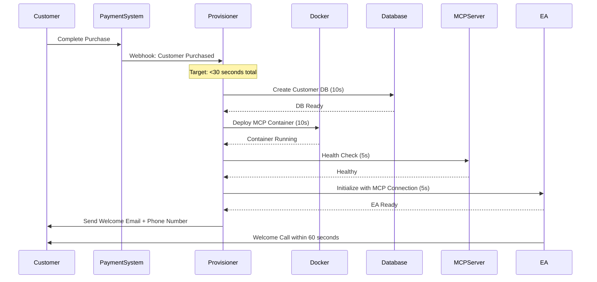

# Per-Customer MCP Server Architecture

## Executive Summary

Replace shared MCPhub infrastructure with isolated per-customer MCP servers to achieve true data separation and eliminate enterprise security concerns.

**Key Change**: Customer A → MCP Server A, Customer B → MCP Server B (no shared infrastructure)

## Architecture Overview

### Current Problem (Shared MCPhub)
```
All Customers → Shared MCPhub → 5-Tier Security Groups
                    ↓
            Potential Data Leakage Risk
            Enterprise Customers Reject
```

### Solution (Per-Customer MCP Servers)
```
Customer A → Dedicated MCP Server A + Memory Service A → Customer A's AI Models
Customer B → Dedicated MCP Server B + Memory Service B → Customer B's AI Models
Customer C → Dedicated MCP Server C + Memory Service C → Customer C's AI Models
                            ↓
            True Isolation, Autonomous Memory, Simplified RBAC
```

## Technical Implementation

### 1. MCP Server Container Architecture

```yaml
Per_Customer_Deployment:
  # MCP Server Container
  mcp_server:
    container_name: "mcp-server-{customer_id}"
    image: "samanhappy/mcphub:customer-isolated"
    ports:
      - "30000-39999" # Dynamic port allocation per customer
    environment:
      - CUSTOMER_ID={customer_id}
      - DATABASE_URL=postgresql://customer_{customer_id}@localhost:5432/customer_{customer_id}
      - REDIS_URL=redis://localhost:6379/customer_{customer_id}
      - MCP_MEMORY_URL=http://mcp-memory-{customer_id}:40000
      - AI_PROVIDER_KEYS={customer_specific_keys}
    volumes:
      - "./customer-data/{customer_id}:/app/data"
      - "./customer-workflows/{customer_id}:/app/workflows"
    networks:
      - "customer-{customer_id}-network"
    resource_limits:
      memory: "2GB"    # Scalable based on customer tier
      cpu: "1.0"       # Adjustable per customer needs

  # MCP Memory Service Container
  mcp_memory_service:
    container_name: "mcp-memory-{customer_id}"
    image: "doobidoo/mcp-memory-service:latest"
    ports:
      - "40000-49999" # Dynamic port allocation per customer
    environment:
      - CUSTOMER_ID={customer_id}
      - MCP_MEMORY_STORAGE_BACKEND=chromadb
      - CHROMADB_HOST=chromadb-{customer_id}
      - CHROMADB_PORT=8000
      - MCP_MEMORY_PORT=40000
      - MCP_HTTP_ENABLED=true
    depends_on:
      - chromadb-{customer_id}
    volumes:
      - "./customer-memory/{customer_id}:/app/data"
    networks:
      - "customer-{customer_id}-network"
    resource_limits:
      memory: "1GB"    # Memory service resources
      cpu: "0.5"       # Autonomous consolidation CPU

  # ChromaDB Container
  chromadb:
    container_name: "chromadb-{customer_id}"
    image: "chromadb/chroma:latest"
    ports:
      - "8000-8999"   # Internal port per customer
    environment:
      - CHROMA_SERVER_HOST=0.0.0.0
      - CHROMA_SERVER_HTTP_PORT=8000
      - ANONYMIZED_TELEMETRY=false
      - CUSTOMER_ID={customer_id}
    volumes:
      - "./customer-chromadb/{customer_id}:/chroma/chroma"
    networks:
      - "customer-{customer_id}-network"
    resource_limits:
      memory: "2GB"    # Vector database resources
      cpu: "1.0"       # Search and indexing CPU
```

### 2. Auto-Provisioning System

```javascript
// Customer MCP Server Provisioning Service
class CustomerMCPProvisioner {
    async provisionCustomerMCP(customerId, customerData) {
        const startTime = Date.now();
        
        try {
            // 1. Allocate dedicated ports (5 seconds)
            const mcpPort = await this.allocatePort(30000, 39999);
            const memoryPort = await this.allocatePort(40000, 49999);
            const chromaPort = await this.allocatePort(8000, 8999);
            
            // 2. Create customer-isolated database (10 seconds)
            await this.createCustomerDatabase(customerId);
            
            // 3. Deploy ChromaDB container (8 seconds)
            const chromaDbId = await this.deployChromaDBContainer({
                customerId,
                port: chromaPort
            });
            
            // 4. Deploy MCP Memory Service container (7 seconds)
            const memoryServiceId = await this.deployMemoryServiceContainer({
                customerId,
                port: memoryPort,
                chromaDbHost: `chromadb-${customerId}`,
                chromaDbPort: 8000
            });
            
            // 5. Deploy dedicated MCP server container (10 seconds)
            const mcpServerId = await this.deployMCPContainer({
                customerId,
                port: mcpPort,
                dbUrl: `postgresql://customer_${customerId}@localhost:5432/customer_${customerId}`,
                redisNamespace: `customer_${customerId}`,
                memoryServiceUrl: `http://mcp-memory-${customerId}:40000`
            });
            
            // 6. Initialize EA with MCP server and memory service connections (5 seconds)
            await this.initializeEA(customerId, mcpServerId, mcpPort, memoryPort);
            
            const provisioningTime = Date.now() - startTime;
            
            return {
                success: true,
                customerId,
                mcpServerId,
                mcpPort,
                memoryServiceId,
                memoryPort,
                chromaDbId,
                chromaPort,
                provisioningTime,
                status: 'ready',
                eaEndpoint: `http://localhost:${mcpPort}/ea`,
                memoryEndpoint: `http://localhost:${memoryPort}/api/v1`
            };
            
        } catch (error) {
            console.error(`MCP provisioning failed for customer ${customerId}:`, error);
            throw error;
        }
    }
    
    async allocatePort() {
        // Find available port in range 30000-39999
        for (let port = 30000; port <= 39999; port++) {
            if (await this.isPortAvailable(port)) {
                return port;
            }
        }
        throw new Error('No available ports for MCP server');
    }
    
    async createCustomerDatabase(customerId) {
        const dbName = `customer_${customerId}`;
        await this.executeSQL(`CREATE DATABASE ${dbName}`);
        await this.executeSQL(`CREATE USER customer_${customerId} WITH PASSWORD '${generateSecurePassword()}'`);
        await this.executeSQL(`GRANT ALL PRIVILEGES ON DATABASE ${dbName} TO customer_${customerId}`);
        
        // Apply customer-specific schema
        await this.applyCustomerSchema(customerId);
    }
    
    async deployMCPContainer(config) {
        const containerName = `mcp-server-${config.customerId}`;
        
        const dockerConfig = {
            name: containerName,
            image: 'samanhappy/mcphub:customer-isolated',
            ports: {
                '3000/tcp': config.port
            },
            environment: {
                CUSTOMER_ID: config.customerId,
                DATABASE_URL: config.dbUrl,
                REDIS_URL: config.redisUrl,
                QDRANT_URL: config.qdrantUrl,
                MCP_PORT: config.port
            },
            networks: [`customer-${config.customerId}-network`],
            resources: {
                memory: 2147483648, // 2GB
                cpu: 1000000000     // 1 CPU
            }
        };
        
        const container = await docker.createContainer(dockerConfig);
        await container.start();
        
        // Health check - wait for MCP server to be ready
        await this.waitForMCPHealth(`http://localhost:${config.port}/health`);
        
        return container.id;
    }
    
    async deployChromaDBContainer(config) {
        const containerName = `chromadb-${config.customerId}`;
        
        const dockerConfig = {
            name: containerName,
            image: 'chromadb/chroma:latest',
            ports: {
                '8000/tcp': config.port
            },
            environment: {
                CHROMA_SERVER_HOST: '0.0.0.0',
                CHROMA_SERVER_HTTP_PORT: '8000',
                ANONYMIZED_TELEMETRY: 'false',
                CUSTOMER_ID: config.customerId
            },
            volumes: {
                [`chromadb_data_${config.customerId}`]: '/chroma/chroma'
            },
            networks: [`customer-${config.customerId}-network`],
            labels: {
                'ai-agency.customer-id': config.customerId,
                'ai-agency.service': 'chromadb'
            },
            resources: {
                memory: 2147483648, // 2GB
                cpu: 1000000000     // 1 CPU
            }
        };
        
        const container = await docker.createContainer(dockerConfig);
        await container.start();
        
        // Health check - wait for ChromaDB to be ready
        await this.waitForChromaHealth(`http://localhost:${config.port}/api/v1/heartbeat`);
        
        return container.id;
    }

    async deployMemoryServiceContainer(config) {
        const containerName = `mcp-memory-${config.customerId}`;
        
        const dockerConfig = {
            name: containerName,
            image: 'doobidoo/mcp-memory-service:latest',
            ports: {
                '40000/tcp': config.port
            },
            environment: {
                CUSTOMER_ID: config.customerId,
                MCP_MEMORY_STORAGE_BACKEND: 'chromadb',
                CHROMADB_HOST: config.chromaDbHost,
                CHROMADB_PORT: config.chromaDbPort.toString(),
                MCP_MEMORY_PORT: '40000',
                MCP_HTTP_ENABLED: 'true',
                LOG_LEVEL: 'INFO'
            },
            networks: [`customer-${config.customerId}-network`],
            labels: {
                'ai-agency.customer-id': config.customerId,
                'ai-agency.service': 'mcp-memory'
            },
            resources: {
                memory: 1073741824, // 1GB
                cpu: 500000000      // 0.5 CPU
            }
        };
        
        const container = await docker.createContainer(dockerConfig);
        await container.start();
        
        // Health check - wait for MCP Memory Service to be ready
        await this.waitForMemoryServiceHealth(`http://localhost:${config.port}/health`);
        
        return container.id;
    }

    async initializeEA(customerId, mcpServerId, mcpPort, memoryPort) {
        const eaConfig = {
            customerId,
            mcpServerUrl: `http://localhost:${mcpPort}`,
            mcpMemoryUrl: `http://localhost:${memoryPort}`,
            mcpServerId,
            personality: 'professional', // Configurable per customer
            businessContext: {}, // Will be learned through conversation
            communicationChannels: ['phone', 'whatsapp', 'email'],
            autonomousConsolidation: true // Enable memory consolidation
        };
        
        // Deploy EA with connection to customer's MCP server and memory service
        await this.deployExecutiveAssistant(eaConfig);
    }
}
```

### 3. Executive Assistant Integration

```javascript
// Executive Assistant with Per-Customer MCP Integration
class ExecutiveAssistant {
    constructor(customerId, mcpServerUrl) {
        this.customerId = customerId;
        this.mcpClient = new MCPClient(mcpServerUrl);
        this.memory = new CustomerMemorySystem(customerId);
        this.workflows = new WorkflowCreator(customerId, mcpServerUrl);
    }
    
    async handleCustomerRequest(request) {
        // All EA operations go through customer's dedicated MCP server
        const context = await this.memory.getBusinessContext(request);
        
        // Use customer's MCP server for AI model access
        const response = await this.mcpClient.chat({
            model: await this.getCustomerPreferredModel(),
            messages: [
                { role: 'system', content: this.getSystemPrompt(context) },
                { role: 'user', content: request.content }
            ],
            customerId: this.customerId // Ensures isolation
        });
        
        // Learn from interaction using customer's isolated memory
        await this.memory.learn(request, response);
        
        // Create workflows if needed using customer's n8n instance
        if (this.shouldCreateWorkflow(response)) {
            await this.workflows.createFromConversation(request, response);
        }
        
        return response;
    }
    
    async getCustomerPreferredModel() {
        // Retrieve customer's AI model preference from their isolated storage
        const preferences = await this.mcpClient.getCustomerPreferences();
        return preferences.aiModel || 'gpt-4o'; // Default fallback
    }
}
```

### 4. Zero-Touch Provisioning Workflow



### 5. Resource Management

```yaml
Resource_Scaling_Strategy:
  starter_tier:
    cpu: "0.5 cores"
    memory: "1GB"
    storage: "10GB"
    concurrent_requests: 100
    
  professional_tier:
    cpu: "2 cores"
    memory: "4GB" 
    storage: "50GB"
    concurrent_requests: 500
    
  enterprise_tier:
    cpu: "4 cores"
    memory: "8GB"
    storage: "200GB"
    concurrent_requests: 1000
    
Auto_Scaling:
  cpu_threshold: 80%
  memory_threshold: 85%
  scale_up_time: "2 minutes"
  scale_down_time: "10 minutes"
  max_instances_per_customer: 3
```

### 6. Security & Isolation

```yaml
Network_Isolation:
  per_customer_networks: "customer-{id}-network"
  no_cross_customer_communication: true
  firewall_rules: "deny all except customer-specific"
  
Data_Isolation:
  database_separation: "customer_{id}" database per customer
  redis_namespacing: "customer_{id}" prefix for all keys
  qdrant_collections: "customer_{id}" collection per customer
  file_system_separation: "/customer-data/{id}" per customer
  
Access_Control:
  customer_owns_mcp_server: true
  no_shared_infrastructure: true
  admin_access: "customer-controlled"
  api_keys: "customer-specific and isolated"
```

## Implementation Benefits

### Security Benefits
- **100% Data Isolation**: No shared infrastructure between customers
- **Enterprise Ready**: Satisfies enterprise security requirements  
- **Simplified RBAC**: Customer owns entire MCP server, no complex permissions
- **Zero Cross-Customer Risk**: Impossible for data leakage between customers

### Operational Benefits
- **Scaling**: Each customer scales independently
- **Customization**: Per-customer AI model preferences and configurations
- **Reliability**: Customer issues don't affect other customers
- **Performance**: Dedicated resources per customer

### Business Benefits
- **Enterprise Sales**: Enables enterprise customer acquisition
- **Premium Pricing**: Justified by dedicated infrastructure
- **Customer Trust**: Complete control over their AI infrastructure
- **Competitive Advantage**: True isolation vs shared systems

## Migration Plan

### Phase 1: Parallel Implementation
1. Build per-customer MCP provisioning system
2. Test with pilot customers
3. Validate 30-second provisioning target
4. Verify complete isolation

### Phase 2: Customer Migration
1. Migrate existing customers to dedicated MCP servers
2. Sunset shared MCPhub infrastructure
3. Update documentation and onboarding

### Phase 3: Scale Validation
1. Test with 100+ concurrent customer MCP servers
2. Optimize resource allocation and costs
3. Validate enterprise customer requirements

---

**Architecture Status**: Ready for Implementation  
**Target Provisioning Time**: <30 seconds  
**Isolation Level**: 100% (zero shared infrastructure)  
**Enterprise Ready**: Yes  
**Cost Impact**: Justified by premium EA pricing