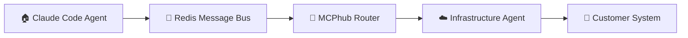

# 🚀 AI Agency Platform - Development Plan

> **15-week roadmap to build your dual-agent AI platform**  
> *Complete coordination between Claude Code agents + Infrastructure agents*

<br>

**Version:** 1.0 • **Lead:** Technical Lead Agent • **Team:** Development Team

---

## 🎯 **What We're Building**

**🏠 Claude Code Agents** → Handle development with direct MCP connections  
**☁️ Infrastructure Agents** → Serve customers via MCPhub with complete isolation

**Goal:** Personal development acceleration + Commercial AI agency scalability

<br>

---

# 🎭 **The Four Acts**

<br>

## 🧪 **ACT 1: TESTING & VALIDATION**
**⏰ Weeks 1-3** • *Build a bulletproof foundation*

> **Mission:** Validate dual-agent architecture and cross-system communication

<br>

### 🎬 **Cast & Crew**

<table>
<tr>
<td width="30%"><strong>🛡️ Security Engineer</strong><br><em>🎭 STARRING ROLE</em></td>
<td width="70%">
<strong>🎯 Mission:</strong> Dual-agent security architecture validation<br>
<strong>🎬 Scene:</strong> MCPhub group isolation testing
</td>
</tr>
<tr>
<td><strong>🖥️ Infrastructure Engineer</strong><br><em>🎭 CO-STAR</em></td>
<td>
<strong>🎯 Mission:</strong> System integration and monitoring setup<br>
<strong>🎬 Scene:</strong> Redis message bus and monitoring infrastructure
</td>
</tr>
<tr>
<td><strong>🌐 API Developer</strong><br><em>🎭 SUPPORTING</em></td>
<td>
<strong>🎯 Mission:</strong> Cross-system API validation<br>
<strong>🎬 Scene:</strong> Customer provisioning and WebSocket communication
</td>
</tr>
</table>

<br>

### 🎬 **Act 1 Scenes**

<details>
<summary><strong>🛡️ Scene 1: Security Validation (Security Engineer)</strong></summary>

**🎯 The Challenge:** Prove customer data isolation works perfectly

**📋 Action Items:**
- ✅ **MCPhub Group Isolation Testing**
  ```bash
  ./scripts/test-customer-isolation.sh
  curl -H "Authorization: Bearer $JWT" \
    http://localhost:3000/api/v1/groups/validate-isolation
  ```
- ✅ **Cross-System Security Boundary Validation**
- ✅ **LAUNCH Bot Security Testing**

**🎁 Deliverables:**
- 📊 Security validation report
- 🔒 Customer isolation proof-of-concept  
- 📋 Cross-system security protocols

</details>

<details>
<summary><strong>🖥️ Scene 2: Infrastructure Setup (Infrastructure Engineer)</strong></summary>

**🎯 The Challenge:** Build rock-solid infrastructure foundation

**📋 Action Items:**
- ✅ **MCPhub Production Deployment**
  ```bash
  docker-compose -f docker-compose.mcphub.yml up -d
  ./scripts/initialize-mcphub-groups.sh
  ```
- ✅ **Redis Message Bus Setup**
- ✅ **Monitoring Infrastructure (Prometheus/Grafana)**

**🎁 Deliverables:**
- 🏰 MCPhub operational with 5 security groups
- 📡 Redis message bus for cross-system communication
- 📊 Comprehensive monitoring dashboard

</details>

<details>
<summary><strong>🌐 Scene 3: API Foundation (API Developer)</strong></summary>

**🎯 The Challenge:** Enable seamless cross-system communication

**📋 Action Items:**
- ✅ **Cross-System API Testing**
- ✅ **Customer Provisioning API Development**
- ✅ **Real-time WebSocket Communication**

**🎁 Deliverables:**
- 🧪 Cross-system API validation suite
- 📚 Customer provisioning documentation
- ⚡ WebSocket communication tests

</details>

<br>

### 🏆 **Act 1 Success Criteria**
- [ ] 🏰 MCPhub operational with 5 security groups
- [ ] 🔒 Customer isolation validated (100% data separation)
- [ ] 📡 Cross-system message bus functional
- [ ] 🛡️ Security boundaries tested and documented
- [ ] 📊 Monitoring infrastructure operational

<br>

---

## 🔨 **ACT 2: BUILDING**
**⏰ Weeks 4-8** • *Create your AI agent army*

> **Mission:** Build and refine Infrastructure agent capabilities

<br>

### 🎬 **Cast & Crew**

<table>
<tr>
<td width="30%"><strong>🤖 AI Specialist</strong><br><em>🎭 STARRING ROLE</em></td>
<td width="70%">
<strong>🎯 Mission:</strong> Infrastructure agent development and LangGraph coordination<br>
<strong>🎬 Scene:</strong> Building the 6 Infrastructure agent types
</td>
</tr>
<tr>
<td><strong>🎯 Technical Lead</strong><br><em>🎭 SUPPORTING</em></td>
<td>
<strong>🎯 Mission:</strong> Agent coordination and workflow optimization<br>
<strong>🎬 Scene:</strong> Multi-agent orchestration system
</td>
</tr>
</table>

<br>

### 🤖 **The Infrastructure Agent Development**

<details>
<summary><strong>🔬 Research Agent (Business Intelligence)</strong></summary>

**🎯 What it does:** Market research, competitive analysis, business intelligence

**💻 Code Example:**
```javascript
const researchWorkflow = new StateGraph({
  nodes: {
    data_gathering: gatherBusinessData,
    analysis: analyzeMarketTrends,
    synthesis: synthesizeInsights,
    reporting: generateReport
  }
});
```

**🎯 AI Specialist Tasks:**
- ✅ Implement business intelligence gathering
- ✅ Market research automation
- ✅ Competitive analysis workflows
- ✅ Report generation and visualization

**🧪 Testing:** Technical Lead validates research accuracy

</details>

<details>
<summary><strong>📈 Business Agent (Analytics & KPIs)</strong></summary>

**🎯 What it does:** Data analytics, KPI tracking, business performance optimization

**💻 Code Example:**
```javascript
class BusinessAnalyticsAgent {
  async analyzeKPIs(customerId) {
    const metrics = await this.postgres.query(`
      SELECT * FROM customer_metrics 
      WHERE customer_id = $1 AND date >= NOW() - INTERVAL '30 days'
    `, [customerId]);
    
    return this.generateInsights(metrics);
  }
}
```

**🎯 AI Specialist Tasks:**
- ✅ PostgreSQL analytics integration
- ✅ KPI tracking and dashboard creation
- ✅ Performance optimization algorithms
- ✅ Financial analysis and forecasting

**🧪 Testing:** Infrastructure Engineer validates database performance

</details>

<details>
<summary><strong>🎨 Creative Agent (Marketing Content)</strong></summary>

**🎯 What it does:** Content generation, brand development, creative marketing

**💻 Code Example:**
```javascript
class CreativeAgent {
  async generateContent(brief, customer) {
    const model = this.selectOptimalModel(brief.type, customer.preferences);
    return await this.createContent(brief, model);
  }
}
```

**🎯 AI Specialist Tasks:**
- ✅ Brand identity development
- ✅ Content generation across formats
- ✅ Social media automation
- ✅ Creative campaign development

**🧪 Testing:** API Developer validates content delivery APIs

</details>

<details>
<summary><strong>⚙️ Development Agent + 🤖 LAUNCH Bot + 🔗 n8n Workflow</strong></summary>

**Development Agent:** Process automation, CI/CD, infrastructure as code  
**LAUNCH Bot:** Self-configuring customer bots (the star of the show!)  
**n8n Workflow:** Visual automation and workflow orchestration

*Full implementation details in the complete plan...*

</details>

<br>

### 🏆 **Act 2 Success Criteria**
- [ ] 🤖 6 Infrastructure agent types fully operational
- [ ] 🔗 LangGraph multi-agent coordination working
- [ ] ⚡ Agent performance optimized (<3s response time)
- [ ] 🌐 Multi-model AI integration validated
- [ ] 🧠 Agent memory and learning systems functional

<br>

---

## ⚙️ **ACT 3: CONFIGURATION**
**⏰ Weeks 9-11** • *Prepare for your first customers*

> **Mission:** Set up customer environments and LAUNCH bot magic

<br>

### 🎬 **Cast & Crew**

<table>
<tr>
<td width="30%"><strong>🛡️ Security Engineer</strong><br><em>🎭 STARRING ROLE</em></td>
<td width="70%">
<strong>🎯 Mission:</strong> Customer isolation and security configuration<br>
<strong>🎬 Scene:</strong> LAUNCH bot self-configuration system
</td>
</tr>
<tr>
<td><strong>🌐 API Developer</strong><br><em>🎭 CO-STAR</em></td>
<td>
<strong>🎯 Mission:</strong> Customer provisioning and management APIs<br>
<strong>🎬 Scene:</strong> Multi-model integration framework
</td>
</tr>
</table>

<br>

### 🤖 **The LAUNCH Bot Magic**

<details>
<summary><strong>⚡ LAUNCH Bot Self-Configuration System</strong></summary>

**🎯 The Vision:** Customer bots that configure themselves in <60 seconds through conversation

**💻 The Magic:**
```javascript
class LaunchBot {
  async handleCustomerConversation(message, state) {
    switch(state) {
      case 'blank':
        return await this.identifyBusinessPurpose(message);
      case 'identifying': 
        return await this.learnRequirements(message);
      case 'learning':
        return await this.setupIntegrations(message);
      case 'integrating':
        return await this.finalizeConfiguration(message);
    }
  }
}
```

**🎯 Security Engineer Tasks:**
- ✅ Customer group provisioning automation
- ✅ LAUNCH bot security configuration
- ✅ Customer-specific tool whitelisting
- ✅ AI model security validation

</details>

<details>
<summary><strong>🚀 Customer Provisioning Automation</strong></summary>

**🎯 The Goal:** Customer environments ready in <5 minutes

**💻 The Command:**
```bash
./scripts/provision-customer-environment.sh \
  --customer-id="cust-001" \
  --ai-model="claude-3.5-sonnet" \
  --industry="healthcare" \
  --compliance="hipaa"
```

**🎯 API Developer Tasks:**
- ✅ Customer provisioning API suite
- ✅ LAUNCH bot management APIs
- ✅ Multi-model integration framework
- ✅ Customer interaction logging

</details>

<br>

### 🏆 **Act 3 Success Criteria**
- [ ] 🚀 Customer environments provisioned in <5 minutes
- [ ] ⚡ LAUNCH bots self-configure in <60 seconds
- [ ] 🔄 Multi-model AI switching operational
- [ ] 🔒 Customer isolation 100% verified
- [ ] 🤖 Automated provisioning system functional

<br>

---

## 🚀 **ACT 4: LAUNCH**
**⏰ Weeks 12-15** • *Go live with real customers*

> **Mission:** Deploy production systems with 99.9% uptime

<br>

### 🎬 **Cast & Crew**

<table>
<tr>
<td width="30%"><strong>🖥️ Infrastructure Engineer</strong><br><em>🎭 STARRING ROLE</em></td>
<td width="70%">
<strong>🎯 Mission:</strong> Production deployment and operations<br>
<strong>🎬 Scene:</strong> Kubernetes production deployment
</td>
</tr>
<tr>
<td><strong>🛡️ Security Engineer</strong><br><em>🎭 CO-STAR</em></td>
<td>
<strong>🎯 Mission:</strong> Production security and compliance<br>
<strong>🎬 Scene:</strong> GDPR/CCPA/HIPAA compliance validation
</td>
</tr>
<tr>
<td><strong>🎯 Technical Lead</strong><br><em>🎭 DIRECTOR</em></td>
<td>
<strong>🎯 Mission:</strong> End-to-end system validation<br>
<strong>🎬 Scene:</strong> Customer onboarding workflow optimization
</td>
</tr>
</table>

<br>

### 🚀 **Production Deployment**

<details>
<summary><strong>🏗️ Kubernetes Production Deployment</strong></summary>

**💻 The Setup:**
```yaml
apiVersion: apps/v1
kind: Deployment
metadata:
  name: customer-{customerId}-launch-bot
spec:
  replicas: 2
  selector:
    matchLabels:
      app: launch-bot
      customer: "{customerId}"
```

**🎯 Infrastructure Engineer Tasks:**
- ✅ Kubernetes production deployment
- ✅ Production monitoring and alerting
- ✅ Backup and disaster recovery
- ✅ Customer environment scaling

</details>

<details>
<summary><strong>🔒 Production Security & Compliance</strong></summary>

**🎯 Security Engineer Tasks:**
- ✅ Production security validation
- ✅ Compliance certification (GDPR, CCPA, HIPAA)
- ✅ Incident response procedures
- ✅ Security audit systems

</details>

<details>
<summary><strong>🎯 End-to-End System Validation</strong></summary>

**🎯 Technical Lead Tasks:**
- ✅ End-to-end system testing
- ✅ Customer onboarding workflow optimization
- ✅ Production optimization and performance tuning

</details>

<br>

### 🏆 **Act 4 Success Criteria**
- [ ] 🚀 Production deployment successful (99.9% uptime)
- [ ] ⚡ Customer onboarding <5 minutes end-to-end
- [ ] 🤖 LAUNCH bots handling real customer traffic
- [ ] 🔒 All compliance requirements met
- [ ] 📊 Monitoring and alerting operational

<br>

---

# 🔄 **Cross-System Coordination**

## 📡 **Claude Code ↔ Infrastructure Communication**



### 📨 **Message Types**
```javascript
const coordinationEvents = {
  'task_started': '🏠 → ☁️',
  'task_completed': '☁️ → 🏠', 
  'error_occurred': '🔄 Both directions',
  'assistance_needed': '☁️ → 🏠',
  'deployment_ready': '🏠 → ☁️'
};
```

### 🎯 **Handoff Checkpoints**
- **🧪 → 🔨** Security validation complete → Development begins
- **🔨 → ⚙️** Infrastructure agents tested → Configuration starts
- **⚙️ → 🚀** Customer environments ready → Deployment begins
- **🚀 ✅** Production system operational → Mission accomplished!

<br>

---

# 📊 **Success Metrics Dashboard**

## 🎯 **Technical Scoreboard**
| Metric | Target | Phase | Status |
|--------|--------|-------|--------|
| 🔒 **Customer Isolation** | 100% data separation | Act 1 | 🎯 |
| ⚡ **Agent Response** | <3 seconds | Act 2 | 🎯 |
| 🤖 **LAUNCH Bot Setup** | <60 seconds | Act 3 | 🎯 |
| 🚀 **Customer Onboarding** | <5 minutes | Act 4 | 🎯 |
| 📈 **System Uptime** | 99.9% availability | Act 4 | 🎯 |

## 💰 **Business Impact**
| Outcome | Measurement | When |
|---------|-------------|------|
| 🏠 **Personal Productivity** | Development velocity increase | Ongoing |
| ☁️ **Commercial Scalability** | Customer agents deployed | Act 4 |
| 🔒 **Security Confidence** | Zero data breaches | Always |
| 💰 **Vendor Independence** | Multi-model support proven | Act 3 |

<br>

---

# 🚨 **Risk Management**

## ⚠️ **High-Risk Scenarios**

<details>
<summary><strong>🔒 Customer Data Isolation Failure</strong></summary>

**Risk:** Data bleeding between customers  
**Impact:** 🔴 CRITICAL  
**Mitigation:** Continuous isolation testing, audit trails  
**Owner:** 🛡️ Security Engineer  
**Detection:** Daily isolation checks

</details>

<details>
<summary><strong>🤖 LAUNCH Bot Configuration Failures</strong></summary>

**Risk:** Customer bots fail to self-configure  
**Impact:** 🟡 MEDIUM  
**Mitigation:** Extensive testing, human escalation protocols  
**Owner:** 🤖 AI Specialist + 🌐 API Developer  
**Detection:** Success rate monitoring

</details>

<details>
<summary><strong>🔗 Cross-System Communication Breakdown</strong></summary>

**Risk:** Claude Code ↔ Infrastructure coordination fails  
**Impact:** 🟠 HIGH  
**Mitigation:** Redis redundancy, fallback protocols  
**Owner:** 🎯 Technical Lead + 🌐 API Developer  
**Detection:** Communication health monitoring

</details>

<br>

---

# 📅 **Timeline Summary**

<table>
<tr>
<th width="20%">🎭 Act</th>
<th width="15%">⏰ Timeline</th>
<th width="35%">🎯 Key Deliverable</th>
<th width="30%">✅ Success Criteria</th>
</tr>
<tr>
<td><strong>🧪 Act 1</strong><br>Testing</td>
<td>Weeks 1-3</td>
<td>Dual-agent architecture validated</td>
<td>Security boundaries verified</td>
</tr>
<tr>
<td><strong>🔨 Act 2</strong><br>Building</td>
<td>Weeks 4-8</td>
<td>6 Infrastructure agents operational</td>
<td>Multi-agent coordination working</td>
</tr>
<tr>
<td><strong>⚙️ Act 3</strong><br>Configuration</td>
<td>Weeks 9-11</td>
<td>Customer provisioning automated</td>
<td>LAUNCH bots self-configuring</td>
</tr>
<tr>
<td><strong>🚀 Act 4</strong><br>Launch</td>
<td>Weeks 12-15</td>
<td>Production system operational</td>
<td>Customer onboarding <5 minutes</td>
</tr>
</table>

**🎯 Total Timeline:** 15 weeks to customer success  
**🔑 Critical Path:** Customer isolation → LAUNCH bot development → Production deployment

<br>

---

<div align="center">

**🎬 Ready for your AI agency adventure?**

**[🚀 Start Act 1](../../scripts/phase-1-start.sh)** • **[👥 Check Assignments](./agent-assignments-matrix.md)** • **[📚 Back to Guide](./README.md)**

*Your Claude Code agents are ready to build the future of AI*

</div>