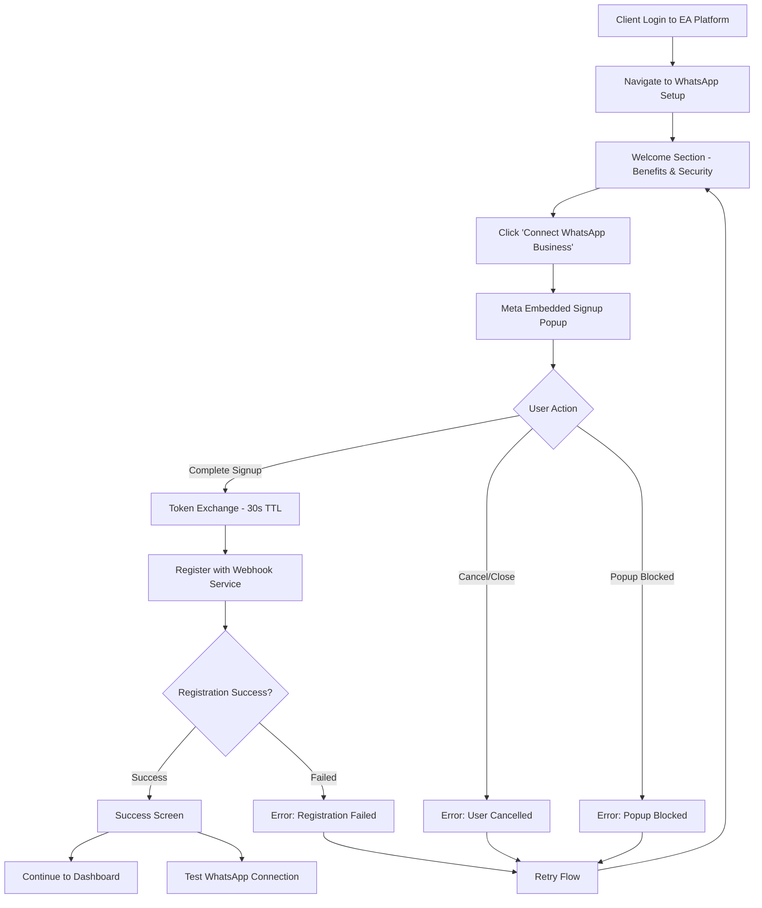

# WhatsApp Business Onboarding - User Journey Flow

## Executive Summary

This document details the complete user journey for integrating Meta Embedded Signup with our centralized WhatsApp webhook service. The design enables EA clients to connect their WhatsApp Business accounts through a compliant, secure flow that maintains our business model where clients "acquire EA WhatsApp Services."

## User Journey Overview

### Flow Architecture


## Detailed User Journey Stages

### Stage 1: Welcome & Benefits Presentation

**User Intent:** Understand value proposition and security of WhatsApp integration

**UI Components:**
- Premium-casual branding aligned with EA personality
- Three benefit cards: Premium EA Services, Business Isolation, Real-time Automation
- Clear CTA: "Connect WhatsApp Business Account"
- Security note: "Secure connection through Meta's official Embedded Signup flow"

**User Actions:**
- Read benefits and security information
- Click primary CTA to begin connection

**Success Metrics:**
- >85% click-through rate on primary CTA
- <10 seconds average time on welcome screen
- >95% understanding of security assurances

### Stage 2: Meta Embedded Signup Flow

**User Intent:** Complete WhatsApp Business account authorization

**Flow Sequence:**
1. **Popup Launch:** Facebook Login for Business modal opens
2. **Business Selection:** User selects WhatsApp Business Account
3. **Permission Grant:** User grants access to WhatsApp Business API
4. **Authorization Code:** Meta returns 30-second TTL code

**Critical Data Captured:**
- `phone_number_id`: Customer's business phone number ID
- `waba_id`: WhatsApp Business Account ID
- `business_id`: Customer's business portfolio ID
- `code`: Exchangeable token for business token exchange

**User Experience Requirements:**
- Popup must not be blocked by browser
- Clear instructions if popup is blocked
- Seamless transition between steps
- Real-time progress indicators

**Error Scenarios:**
- **Popup Blocked:** Show troubleshooting with retry option
- **User Cancellation:** Friendly error with retry encouragement
- **Permission Denied:** Clear explanation of required permissions
- **Network Issues:** Retry mechanism with status updates

### Stage 3: Token Exchange & Registration

**User Intent:** Secure connection to EA WhatsApp services

**Process Flow:**
1. **Token Exchange (Backend):** Convert 30s TTL code to long-term business tokens
2. **EA Registration:** Register client with centralized webhook service
3. **Validation:** Confirm webhook routing and message handling

**Progress Indicators:**
- Step 1: Meta Signup Popup ✓
- Step 2: Grant Permissions ✓
- Step 3: Token Exchange (Active)
- Step 4: EA Registration (Pending)

**Real-time Updates:**
- Status titles change every 2-3 seconds during processing
- Visual spinners show active processing
- Completed steps show checkmarks
- Failed steps show error indicators

**Error Handling:**
- **Token Exchange Failed:** Usually expired code (>30s) or invalid configuration
- **Registration Failed:** Webhook service unavailable or configuration error
- **Network Timeout:** Automatic retry with exponential backoff

### Stage 4: Success & Next Steps

**User Intent:** Confirm successful connection and understand next actions

**Success Confirmation:**
- Connected business phone number display
- WhatsApp Business Account ID confirmation
- Integration status: "Active & Receiving Messages"

**Next Steps Guidance:**
1. **Test Connection:** Send test message to verify EA responses
2. **Configure EA Settings:** Customize personality and business knowledge
3. **Monitor Performance:** Dashboard tracking for engagement and automation

**User Actions:**
- Continue to EA Dashboard (primary)
- Test WhatsApp Connection (secondary)
- Review integration details

### Stage 5: Error Recovery & Support

**User Intent:** Resolve connection issues and get help

**Error Types & Solutions:**

**Connection Cancelled:**
- Friendly retry messaging
- Explanation of why connection is beneficial
- Single-click retry mechanism

**Popup Blocked:**
- Browser-specific instructions
- Alternative flow suggestions
- Popup permission guidance

**Token Exchange Failed:**
- Technical explanation in user-friendly terms
- Automatic retry mechanism
- Contact support option

**Registration Failed:**
- Webhook service status check
- Alternative configuration options
- Direct support contact with error details

**Support Integration:**
- Pre-populated support emails with error details
- Real-time chat widget integration
- Knowledge base links for common issues

## User Experience Principles

### Premium-Casual Personality Integration
- **Tone:** Professional capabilities with approachable personality
- **Language:** Sophisticated yet conversational (e.g., "Let's get your WhatsApp connected!")
- **Visuals:** Clean, modern design with friendly illustrations
- **Interactions:** Smooth animations and micro-interactions

### Accessibility Standards
- **WCAG 2.1 AA Compliance:** Full keyboard navigation, screen reader support
- **Responsive Design:** Mobile-first approach with tablet and desktop optimization
- **Color Contrast:** 4.5:1 minimum ratio for all text
- **Focus Management:** Clear focus indicators and logical tab order

### Performance Requirements
- **Initial Load:** <2 seconds for welcome screen
- **SDK Loading:** <3 seconds for Facebook SDK initialization
- **Token Exchange:** <5 seconds for complete flow
- **Error Recovery:** <1 second for error state transitions

## Integration Points

### Backend API Endpoints
```javascript
POST /api/whatsapp/exchange-token
- Exchange Meta authorization code for business tokens
- Input: { code, customer_id, redirect_uri }
- Output: { phone_number_id, waba_id, business_id, access_token }

POST /api/ea/register
- Register EA with centralized webhook service
- Input: { customer_id, phone_number_id, waba_id, business_id, access_token }
- Output: { registration_id, webhook_url, status }

POST /api/ea/test
- Test WhatsApp connection with EA
- Input: { customer_id, phone_number }
- Output: { success, message_id, delivery_status }

GET /api/clients/{customer_id}
- Fetch client information for personalization
- Output: { name, company, preferences, current_integrations }
```

### Webhook Service Integration
```javascript
POST ${WEBHOOK_SERVICE_URL}/api/ea/register
- Register client EA with centralized service
- Establishes message routing to client's private EA
- Configures per-customer isolation and security

GET ${WEBHOOK_SERVICE_URL}/api/ea/status/{customer_id}
- Check EA registration and connection status
- Validate webhook routing functionality
- Monitor message delivery success rates
```

### Client-Side Configuration
```javascript
const config = {
    facebookAppId: 'YOUR_FACEBOOK_APP_ID',
    configurationId: 'YOUR_WHATSAPP_CONFIG_ID',
    webhookServiceUrl: 'https://your-webhook-service.ondigitalocean.app',
    redirectUrl: window.location.origin + '/whatsapp-onboarding/success'
};
```

## Success Metrics & KPIs

### Onboarding Conversion
- **Completion Rate:** >80% of users who start complete the flow
- **Time to Complete:** <3 minutes average for successful connections
- **Error Recovery Rate:** >70% of users retry after initial errors
- **Support Contact Rate:** <5% of users require direct support

### Technical Performance
- **SDK Load Time:** <3 seconds for 95th percentile
- **Token Exchange Success:** >95% success rate within 30-second TTL
- **Registration Success:** >98% success rate for valid tokens
- **Connection Validation:** 100% accuracy for connection status

### Business Impact
- **EA Activation:** >90% of connected clients activate EA WhatsApp features
- **Message Volume:** >50% increase in EA interactions post-connection
- **Customer Satisfaction:** >4.5/5.0 rating for onboarding experience
- **Support Reduction:** >60% decrease in WhatsApp-related support tickets

## Security & Compliance

### Data Protection
- **Customer Isolation:** Complete data separation through per-customer MCP servers
- **Token Security:** Business tokens stored securely with encryption at rest
- **HTTPS Enforcement:** All communication over TLS 1.3
- **GDPR Compliance:** Data processing within customer boundary controls

### Meta Compliance
- **Official Embedded Signup:** Uses Meta's approved integration method
- **Permission Scoping:** Requests only necessary WhatsApp Business permissions
- **Token Lifecycle:** Proper handling of 30-second TTL authorization codes
- **Webhook Validation:** Signature verification for all webhook payloads

### Audit & Monitoring
- **Connection Logging:** Complete audit trail of all connections
- **Error Tracking:** Detailed error reporting and resolution tracking
- **Performance Monitoring:** Real-time metrics on flow completion rates
- **Security Scanning:** Regular security assessments of integration points

## Future Enhancements

### Phase 2 Improvements
- **Multi-language Support:** Spanish/English bilingual onboarding
- **Bulk Client Setup:** Enterprise clients connecting multiple WhatsApp accounts
- **Advanced Configuration:** Custom webhook endpoints and routing rules
- **Integration Testing:** Built-in connection validation and testing tools

### Analytics Integration
- **User Behavior Tracking:** Detailed flow analytics with heatmaps
- **A/B Testing Framework:** Test different onboarding flows and messaging
- **Predictive Analytics:** Identify and prevent potential connection failures
- **Success Scoring:** ML-powered prediction of successful EA adoption

This user journey design ensures that clients can seamlessly acquire EA WhatsApp Services while maintaining the security, compliance, and premium-casual experience that defines our platform.